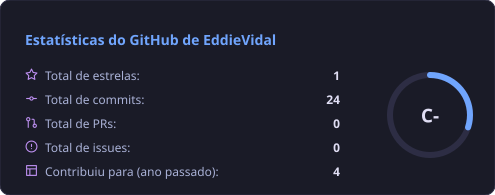
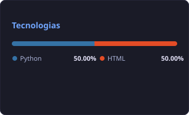

# 👨‍💻 Edson Vidal

**`Hybrid Solutions Developer`**  **`Creative Software Engineer & Solution Developer`**

Me chamo Edson Vidal, sou natural de Niterói no Rio de Janeiro. Atualmente, estou estudando Desenvolvimento de Software e automação Focado em Python, utilizo ferramentas modernas como VS Code e IA
generativa para criar aplicações desktop eficientes e automatizar fluxos de trabalho, com um interesse 
crescente em arquitetura de sistemas e virtualização. Sou apaixonado por tecnologia.

**`Design Gráfico & Arte Digital:`** 

Minha base em artes visuais (Photoshop, Illustrator, InDesign e Affinity) me 
permite criar identidades visuais com foco em padrões geométricos, logo design e vetores, sempre priorizando 
a fidelidade conceitual e a estética.

🔗 Conecte-se comigo: [Linkedin](https://www.linkedin.com/in/edson-vidal-69a656130/).

### Além do Código
Acredito que o desenvolvimento de alto nível exige um equilíbrio entre a intuição criativa, o rigor estratégico e a resistência física. Minhas práticas fora das telas são onde recarrego a energia e refino as habilidades que aplico no meu trabalho:

**`Música & Produção de Áudio:`** Como guitarrista e entusiasta do Reaper, aprendi que a técnica é tão vital quanto a criatividade. A disciplina da produção musical é a base da minha organização lógica e do meu fluxo de trabalho estruturado.

**`Xadrez:`** É onde exercito a estratégia, a antecipação de cenários e a visão sistêmica. Essas competências são o meu diferencial na resolução de problemas complexos e na arquitetura de sistemas.

**`Mountain Bike:`** Nas trilhas, desenvolvo a resiliência e a capacidade de navegação em terrenos desafiadores. O ciclismo me ensinou que, assim como em um projeto complexo, o foco constante e a adaptabilidade são essenciais para superar obstáculos e alcançar o objetivo final.

    
     
    
    

---
 

 
    <b>🤖 Linguagens e Tecnologias<b>

 
 

 

### 📊 Estatísticas

  
  
    

